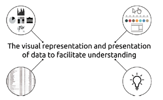
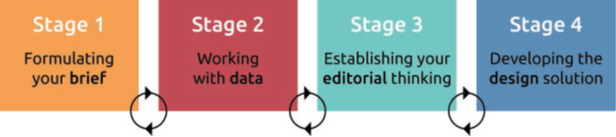
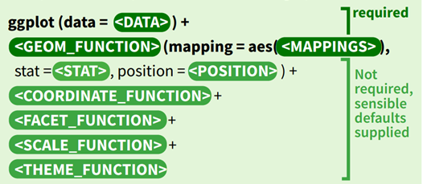
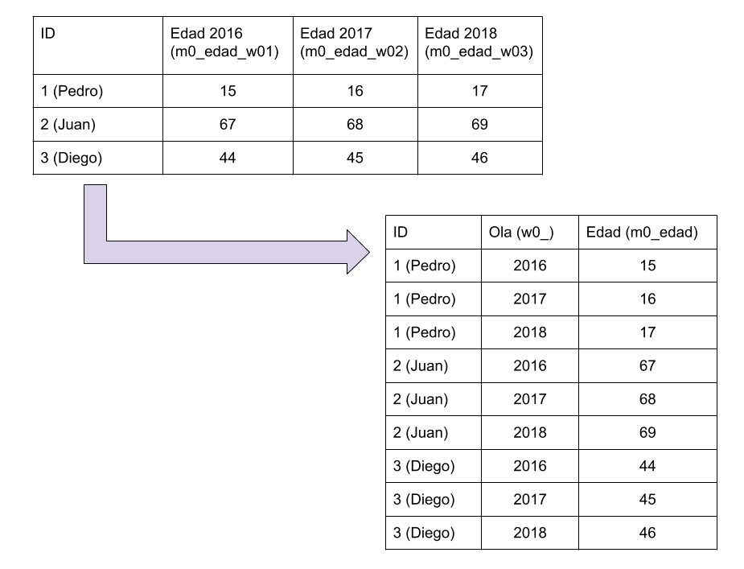
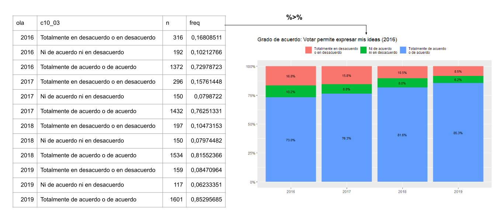

```{r setup, include=FALSE}
options(htmltools.dir.version = FALSE)
knitr::opts_chunk$set(
  fig.width=9, fig.height=3.5, fig.retina=3,
  out.width = "100%",
  cache = FALSE,
  echo = TRUE,
  message = FALSE, 
  warning = FALSE,
  hiline = TRUE
)
names(xaringan:::list_css())
```

```{r librerias-dataset, include=FALSE}
#load("../1_input/data/procesada/elsoc.RData")
library(tidyverse)
library(broom)
library(texreg)
```

class: inverse, middle

# Contenidos del curso

**Bloque teórico**

1. Lógica de la visualización de datos longitudinales

2. Flujo de trabajo para visualización 

  - flujo clásico 
  - flujo tidyverse

**Bloque práctico**

1. Visualización de datos con ggplot2
  * Gráfico de barra
  * Gráfico de barra apilada
  * Gráfico de puntos
  * Gráfico alluvial 
---

class: inverse, center, middle

# I. Lógica de la visualización de datos longitudinales

---

# 1.1. ¿Qué es la visualización de datos?

--

<br>

*	“En términos simples, se trata de gráficos y el acto de seleccionar el gráfico correcto para mostrar las características de los datos que se cree que son más relevantes.” (Kirk, 2018, p.17) 

--

* Se debe ser fiel a los datos, por lo que es muy importante un **buen tratamiento de base de datos**.

--

```{r intro, echo=FALSE, fig.align='center', fig.height=1, out.height="70%", out.width="70%", fig.cap='A Definition for Data Visualisation. Fuente: Kirk (2018)'}

```
  
---
# 1.2. Fases de la visualización de datos.

```{r fases, echo=FALSE, fig.align='center', fig.height=1, out.height="80%", out.width="80%", fig.cap='The Four Stages of the Data Visualisation Design Process. Fuente: Kirk (2018)'}

```

1. **Formula tu plan de trabajo**: planifica, define e inicia tu proyecto.

--

2. **Trabajando con la base de datos**: produce, maneja y prepara tus datos.

--

3. **Establece tu pensamiento editorial**: define qué le mostrarás a tu audiencia.

---

# 1.3. Ventajas y desventajas de los gráficos 

Ventajas de los gráficos

--

-	Facilita el **entendimiento** de los datos, lo cual fomenta abrir la ciencia.

--

-	Tiene la capacidad de **resumir** datos, mostrando los elementos más relevantes.

--

-	Es **atractivo** y capta mejor la atención de los y las lectoras.

--

Desventajas de los gráficos

--

- Limitaciones visuales a medida que crece la cantidad de variables que quiero representar

---
# 1.4. Cómo **NO** visualizar datos.

-	Más allá de lo estético, el error más grande que se puede cometer es la **mala representación de los datos**, lo que probablemente se debe a un mal manejo de la base de datos

--

-	Un ejemplo de esto es el gráfico ¿Crisis de fe en la democracia? (New York Times), que veremos a continuación. 

---
## ¿Crisis de la fe en la democracia?

```{r nyt, echo=FALSE, fig.align='center', fig.height=1, out.height="80%", out.width="80%", fig.cap=' A crisis of faith in democracy? (New York Times). Fuente: Healy (2018)'}
knitr::include_graphics("imagenes/nyt.png")
```

---

## Quizás no tanto...

```{r nyt_b, echo=FALSE, fig.align='center', fig.height=1, out.height="80%", out.width="80%", fig.cap='Perhaps the crisis has been overblown. (Erik Voeten). Fuente: Healy (2018)'}
knitr::include_graphics("imagenes/nyt_b.png")
```

---

class: inverse, center, middle

# II. Flujo de trabajo para visualizar datos

---

# 2.1. Flujo tidyverse
```{r flujo, echo=FALSE, fig.align='center', fig.height=1, out.height="80%", out.width="80%", fig.cap='Flujo de trabajo de datos Tidyverse. Fuente: Wickham & Grolemund (2016)'}
knitr::include_graphics("imagenes/flujo-tidyverse.png")
```

--

- **Flujo clásico:** separación entre *wrangle* y *visualise*.

  - Un código para preparar los datos y otro para analizarlos.

--

- **Flujo tidyverse:** orientado a la comunicación de datos

  - herramientas tidyverse permiten juntar en un mismo código *wrangle* y *visualise* (o preparación y análisis).

---

#. 2.2. Visualización con ggplot

-	Para la visualización de datos se utiliza el paquete `ggplot2`, el cual pertenece a `tidyverse`. Al igual que otros paquetes de R, presenta distintas funciones que van **desde el manejo de los datos hasta la estética en los gráficos**. 

--

```{r ggplot, echo=FALSE, fig.align='center', fig.height=1, out.height="80%", out.width="80%", fig.cap='Fuente: Cheat Sheet ggplot2'}

```

---

# 2.3. Componentes **ggplot2**

 
* Data [`data`]: Es la base donde se encontrarán los datos para la creación de los gráficos 

* Geometries [`geoms`]: Configura los elementos visuales de los gráficos. Puede modificar datos estadísticos y estética.

* Aesthetics [`aes`]: Se encarga de la estética del gráfico. Se puede cambiar lo colores, tamaños y formas. También, es posible hacer agrupaciones y editar la posición (x, y). 

* Stats [`stat`]: Se utiliza para hacer transformaciones estadísticas que nos permite comprender los datos.

---
<br>

* Position [`Position`]: Los ajustes de posición determinan cómo organizar [`geoms`].

* Coordinate systems [`coord`]: Modifica los ejes *x* e *y*. Si es que este no es modificado, por defecto se genera el plano cartesiano.

* Facetting [`facet`]: Sive para realizar conjuntos o sub - conjuntos de datos.

* Scale [`scale`]: Transforma valores de la base de datos a valores visuales con su respectiva estética.

* Themes [`theme`]: Controla la visualización de todos los elementos gráficos, a excepción de los datos. 

---

# 2.4. Preámbulo del bloque práctico

**Pasos:**

1. cargar librerías y dataset

2. limpieza dataset

3. transformar datos de wide a long (¿por qué?)

4. generar tabla con datos a visualizar

3. encadenar tabla con funciones de `ggplot2`.

---

## Paso de wide a long

```{r widealong, echo=FALSE, fig.align='center', fig.height=1, out.height="80%", out.width="80%", fig.cap='Fuente: Elaboración propia.'}

```

---

## Encadenar datos y la visualización con ggplot

```{r encadenar, echo=FALSE, fig.align='center', fig.height=1, out.height="100%", out.width="100%", fig.cap='Fuente: Elaboración propia en base a datos ELSOC (2021).'}

```

---
# III. Referencias


1. Healy, K. (2018). Data visualization: a practical introduction. Princeton University Press.
[https://socviz.co/index.html/](https://socviz.co/index.html/)

2. Kirk, A. (2016). Data visualisation: A handbook for data driven design. Sage. [https://book.visualisingdata.com/](https://book.visualisingdata.com/)

3. Wickham, H., & Grolemund, G. (2016). R for data science: import, tidy, transform, visualize, and model data. O'Reilly Media, Inc. [https://es.r4ds.hadley.nz/](https://es.r4ds.hadley.nz/.)

4. [ELSOC] Reproducible Research, Centre for Social Conflict and Cohesion Studies COES. (2021). Estudio Longitudinal Social de Chile 2016-2019 [Data set]. Harvard Dataverse. [https://doi.org/10.7910/DVN/SOQJ0N](https://doi.org/10.7910/DVN/SOQJ0N)


---

class: inverse, center, middle

# Gracias por su atención!
**cristobal.ortiz.v@ug.uchile.cl**

